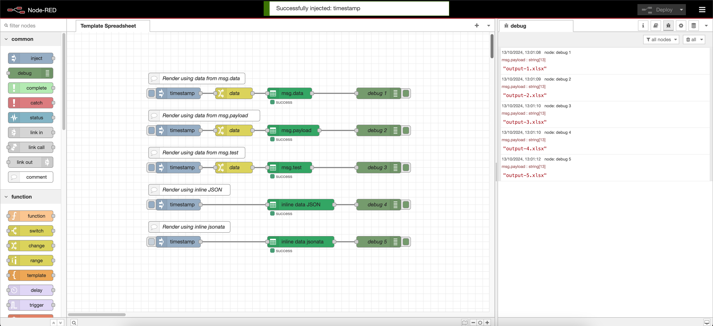

# node-red-spreadsheet-template

Use this node to create spreadsheets using a spreadsheet template.

## 📖 How to test your node

1. open a terminal in the root of this project
2. run `npm install`
3. run `npm run start` and wait for your browser to open

## Usage

### 1 - Configure the node inputs

Like the `payload`, all other inputs can be set using the `msg` object, as follows:

- `msg.templateFilepath`
- `msg.templateSheetName`
- `msg.outputFilepath`

> [!IMPORTANT]
>
> `msg` values take precedence over the values set in the node's form.

### 2 - Create a spreadsheet template

### 3 - Define the data

> [!IMPORTANT]
>
> `msg.payload` must be an array of objects.

### 4 - Run the flow

### 5 - Verify the output.xlsx

